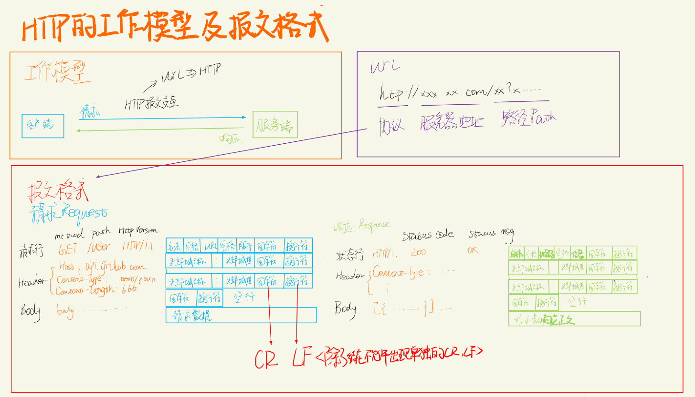

[TOC]

# HTTP原理及工作机制

### HTTP(Hypertext Transfer Protocol)—— 超文本传输协议

它是用于传输超文本的协议，包括HTML及WebAPI数据

- 支持C/S模式
- 简单快速
  HTTP 协议简单，使得HTTP服务器的程序规模小，因而通信速度很快
- 灵活
  HTTP允许传输任意类型的数据对象。正在传输的类型由Content-Type加以标记
- 无连接
  限制每次连接只处理一个请求，节省传输时间
- 无状态
  协议对于事务处理没有记忆能力。缺少状态意味着如果后续处理需要前面的信息，则它必须重传，这样可能导致每次连接传送的数据量增大；而另一方面，在服务器不需要先前信息时它的应答速度就较快

### 工作模型及报文格式

HTTP协议是属于应用层的传输协议，通过客户端组装报文发送只服务端进行处理，并接收服务端的响应报文进行解析来完成工作。

### Request Method

| Method | 用于                                                    |        |
| ------ | ------------------------------------------------------- | ------ |
| GET    | 获取资源                                                | 无Body |
| POST   | 增改资源                                                | 有Body |
| PUT    | 修改资源                                                | 有Body |
| DELETE | 删除资源                                                | 无Body |
| HEAD   | 获取资源的响应消息报头。相当于GET，响应时不需要返回Body | 无Body |
| ...    |                                                         |        |

### Status Code

- **1xx：临时性消息、指示信息，收到请求，需要请求者继续执行操作**
  - 100：多段上传，提供简短临时的确认
  - 101：确定服务器支持的协议--客户端试探
- **2xx：成功、请求已被成功接收并处理**
- **3xx：重定向、要完成请求必须进行更进一步的操作**
  - 301：永久性迁移
  - 302：临时迁移
  - 304：内容无变更，无须再次请求
- **4xx：客户端错误、请求有语法错误或请求无法实现**
  - 400：请求有语法错误
  - 401：请求未经授权
  - 403：服务器收到请求，但拒绝提供服务
- **5xx：服务器错误、服务器不能实现合法的请求**
  - 500：服务器内部错误
  - 503：服务暂不可用

### 消息报头——Header

由键值对组成，为HTTP消息的元数据，可理解为这次报文数据的数据信息

1. 通用报头

   | Header        | 意义                   | Remark                                                       |
   | ------------- | ---------------------- | ------------------------------------------------------------ |
   | Date          | 消息产生的日期时间     |                                                              |
   | Connection    | 允许发送指定连接的选项 | 指定连接是连续的或是“close”，在完成响应后关闭连接、为Keep-Alive则表示保持连接 |
   | Cache         | 缓存、留待下次使用     | *Buffer：缓冲，针对工作流，用于提前生产存储，如视频流提前拉取存储* |
   | Cache-Control | 用于指定缓存指令       | 缓存指令是单向的（响应中出现的缓存指令在请求中未必会出现），且是独立的（一个消息的缓存指令不会影响另一个消息处理的缓存机制） no-cache：使用前询问是否失效 no-store：不用存储 max-age：多久前不需要询问 private/public：表示是否给其它访问者使用（中间网关是否缓存） |

2. 请求报头

   | Header            | 意义                                                       | Remark                                                       |
   | ----------------- | ---------------------------------------------------------- | ------------------------------------------------------------ |
   | Host              | 请求的主机名                                               | 虚拟主机允许多个域名同处一个IP地址，用于确定真实访问主机     |
   | User-Agent        | 发送请求的信息                                             | 浏览器类型、操作系统等信息，用于服务器返回最佳适配的响应数据 |
   | Accept            | 客户端可识别的内容类型列表                                 | 用于指定客户端接收哪些类型的信息                             |
   | Accept-Charset    | 客户端可识别的字符集                                       |                                                              |
   | Accept-Encoding   | 客户端可接收的压缩编码类型                                 |                                                              |
   | Content-Encoding  | 压缩类型                                                   |                                                              |
   | Accept-Language   | 客户端支持的语言类型                                       |                                                              |
   | Transfer-Encoding | 告知接收端为了保证报文的可靠传输，对报文采用了什么编码方式 | chunked：表示Body长度无法确定，Content-length无法使用（Body中持续预告下一段长度直到长度为0（4*下一段长度*  aaaa ...... 0 *传输结束*）） |

   

3. 响应报头

   | Header   | 意义                             | Remark                         |
   | -------- | -------------------------------- | ------------------------------ |
   | Location | 用于重定向接收者到一个新的位置   | 常用在更换域名的时候           |
   | Server   | 包含服务器用来处理请求的系统信息 | 与User-Agent请求报头是相对应的 |

4. 实体报头

   | Header           | 意义                                     | Remark                                                       |
   | ---------------- | ---------------------------------------- | ------------------------------------------------------------ |
   | Content-Type     | 发送给接收者的实体正文的媒体类型         | text/html：HTML文本 application/x--www-form-urlencoded：普通表单(k=v&k.....) multpart/form-data：多部分形式，一般用于传输包含二进制的多项内容(定义一个分界线boundary用于分割多文件内容(boundary...Content-type........  boundary........)) application/json：Json形式 image/jpeg application/zip...：单文件形式 |
   | Content-Lenght   | 实体正文的长度                           | 二进制没有办法定义分割符                                     |
   | Content-Language | 描述资源所用的自然语言                   |                                                              |
   | Content-Encoding | 实体报头被用作媒体类型的修饰符           | 它的值指示了已经被应用到实体正文的附加内容的编码，因而要获得Content-Type报头域中所引用的媒体类型，必须采用相应的解码机制 |
   | Last-Modified    | 实体报头用于指示资源的最后修改日期和时间 |                                                              |
   | Expires          | 实体报头给出响应过期的日期和时间         |                                                              |

   